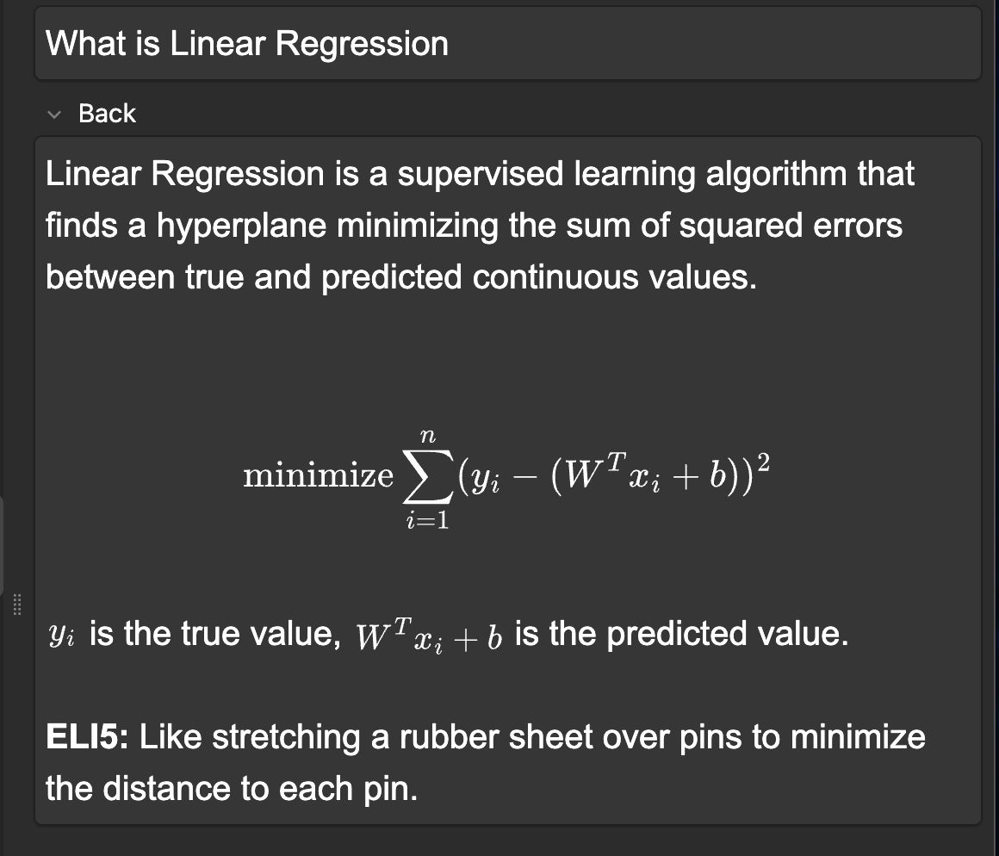

# Curriculum2Anki

A production-grade knowledge distillation pipeline for converting long-form technical content into high-signal Anki decks.

Curriculum2Anki converts large, messy, real-world documents into review-efficient Anki flashcards using LLMs, while enforcing strict quality, structure, and recall constraints.

> **This is not a flashcard generator.**
> **It is a knowledge distillation system.**

If a card cannot be confidently recalled in under 10 seconds, it does not belong.

## What problem this actually solves

Most AI flashcard tools fail in predictable ways:

- Over-generate low-signal cards
- Ignore curriculum structure
- Hallucinate relationships
- Break math rendering
- Cannot resume after failure
- Provide zero observability
- Corrupt decks silently

Curriculum2Anki was built by repeatedly hitting these failures and eliminating them systematically, not by prompt tweaking.

In one real run, it produced 900+ reviewable cards from a ~100k token document for ~$0.20, using free and low-cost OpenRouter models.

## What this system does

Converts long markdown documents into Anki-importable CSV decks.

**Designed for:**
- Course notes
- Technical books
- Interview prep material
- Research summaries

**Enforces hard card quality gates:**
- Aligns cards to curriculum structure, not brittle numbering
- Uses free or low-cost LLMs with automatic fallback
- Supports resume-after-interruption
- Produces deterministic, review-ready output

**If a card is generated, it is:**
- Atomic
- Self-contained
- Strictly formatted
- LaTeX-validated
- Worth reviewing

Silence is preferred over noise.

## Sample card



## Core design principles

### 1. Knowledge distillation, not summarization
The pipeline extracts concepts first, then distills them into atomic recall units.
Coverage is capped deliberately. Precision wins.

### 2. Defensive parsing by default
Input documents are assumed to be:
- Inconsistently structured
- Poorly formatted
- Noisy
- Partially broken

The system therefore:
- Uses header-based chunking with fallbacks
- Ignores formatting noise
- Falls back to semantic matching
- Refuses to guess when alignment is ambiguous

This reduced hallucinations more than any prompt change.

### 3. Curriculum as source of truth
A lightweight CSV (`curriculum_extracted.csv`) acts as the authoritative schema:
- Module
- Chapter
- Lecture titles

Document structure is mapped to this schema, never trusted blindly.
**If alignment fails, generation stops.**

This makes the pipeline portable across courses, books, and internal knowledge bases.

### 4. Quality gates are non-negotiable
Bad cards permanently damage an Anki deck. Cards are dropped if they fail checks such as:
- Front longer than 12 words
- Missing mandatory ELI5 explanation
- Broken or unbalanced LaTeX
- Duplicate or overlapping concepts
- Explanation without substance
- Length violations

The system prefers generating nothing over generating garbage.

### 5. Observability and resumability
This is built for long-running jobs, not demos.

- Batch-level progress tracking
- Per-chapter progress and ETA
- Model success and failure telemetry
- Resume state persisted to disk
- Append-only CSV output

If the process crashes, rerun it. **Nothing is lost.**

## Directory structure

```text
.
├── README.md                    This document
├── STORY.md                     Design history and evolution
├── curriculum_extracted.csv     Curriculum schema (source of truth)
├── markdowns/                   Input markdown documents
├── output/                      Generated decks and resume state
├── prompts/                     Versioned LLM prompts
├── validators/                  Hard quality gates
├── telemetry/                   Model probing and health stats
├── docs/
│   └── AAIC_DECK_STANDARD.md    Deck invariants and rules
├── main.py                      Stable production pipeline
├── archived/                    Historical pipeline iterations
└── get_free_models.py           Free-model probing and validation

```

## How to run

**1. Install dependencies**

```bash
pip install -r requirements.txt

```

**2. Set API key**

```bash
export OPENROUTER_API_KEY=your_key

```

**3. Run on all markdown files**

```bash
python main.py

```

**4. Run on a single document**

```bash
python main.py --file markdowns/your_doc.md

```

### Resume after interruption

Just rerun the same command.
Progress is restored automatically from disk.

Generated CSVs appear in `output/` and can be imported directly into Anki.

## Model strategy

* Designed for free and low-cost OpenRouter models
* Models are actively probed via `get_free_models.py`
* Only verified, structured-output-capable models are used
* Provider and model failures are treated as expected behavior

Model unreliability is a constraint, not an exception.

## Why this is production-grade

* Rate-limit aware
* Provider-aware fallback
* JSON repair logic
* Idempotent batch processing
* Deterministic output
* Resume safety
* Explicit failure modes
* No silent corruption

This code reflects real failure conditions, not ideal ones.

## How this generalizes beyond courses

The core abstraction is:
`Text → Concepts → Validated Recall Units`

With minimal changes, this pipeline can power:

* Book-to-Anki systems
* Internal knowledge base distillation
* Interview prep generators
* Onboarding documentation agents
* Personal knowledge graphs

It is domain-agnostic by design.

## How this maps to real-world AI systems

This project exercises multiple production-level AI concerns:

* Long-context handling
* Cost-aware LLM orchestration
* Reliability under partial failure
* Agent-like task decomposition
* Deterministic post-processing
* Human-quality enforcement via hard gates

The LLM calls are not the hard part.
Everything around them is.

## Philosophy

* Prefer under-generation to noise
* Prefer determinism to cleverness
* Prefer correctness to coverage
* Prefer systems that explain themselves

**Rules the system enforces:**

1. If a card is hard to review, delete it.
2. If alignment is unclear, stop.
3. If a model misbehaves, route around it.

## Status

* Actively evolving
* Built rapidly, but deliberately
* Designed to scale into internal tooling or SaaS
* Optimized for recall efficiency, correctness, and cost

**If you are reading this as a reviewer or interviewer:**

This repository exists to demonstrate systems thinking around LLM-powered pipelines, not prompt engineering tricks.
The value is in the constraints, the failure handling, and the refusal to generate garbage.
